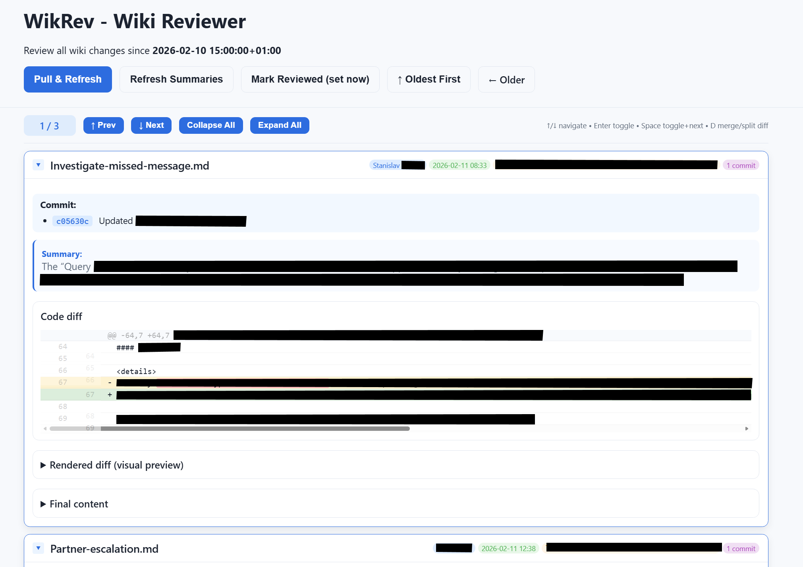

# WikRev - Wiki Reviewer

A simple web app to review recent markdown changes in a git-based wiki with diffs, collapsing consecutive edits by the same person, previews, and optional AI summaries. Fast keyboard based navigation included!

Marvelous for periodic team overviews what's new in your knowledge base :)

> **Note:** This project was mostly AI-generated.



## Motivation

Our team does weekly reviews of all wiki changes to share knowledge and stay aligned. Our wiki lives in the Azure DevOps wiki system, which stores content as a set of markdown files in a separate git repository. This tool was built to make those weekly review sessions easier—providing a clear view of what changed, who changed it, and why.

## Quick Start

```bash
uv pip install -e .
uv run wikrev
```

Open http://127.0.0.1:8010

## Features

- Shows markdown changes since last review
- Merges consecutive commits by same author on same file
- Displays raw diff, rendered diff, and final preview
- Optional AI summaries via GitHub Copilot SDK (needs Copilot CLI installed and authenticated)

## Config

Edit `config.json`:

| Key | Description |
|-----|-------------|
| `repo_path` | Path to the wiki repo |
| `last_run` | ISO timestamp (or null for default) |
| `enable_copilot` | Enable AI summaries |

## Requirements

- Python 3.10+
- Git
